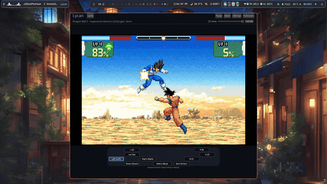

<h1 align="center">Lycan </h1>

<p align="center">A Game Boy Advance emulator written in Rust, for desktop and the browser.</p>

<p align="center">
  <a href="https://lycan-44o.pages.dev/">Play in browser</a> ·
  <a href="https://github.com/Aditya-1304/Lycan/releases">Native releases</a> ·
  <a href="#getting-started">Getting started</a> ·
  <a href="#building-from-source">Build from source</a> ·
  <a href="https://github.com/Aditya-1304/Lycan/issues">Report a bug</a>
</p>

<p align="center">
  <a href="https://github.com/Aditya-1304/Lycan/actions/workflows/ci.yml">CI checks</a> ·
  <a href="LICENSE"></a>
</p>

Lycan brings GBA games to a native desktop player and a WebAssembly browser app.
Both frontends share the same emulation core, with keyboard controls, audio,
cartridge saves, and a focused player interface.

## Demo

<!-- Replace this preview and MP4 link with the standalone GitHub attachment URL
     after uploading assets/demo/lycan-demo-with-music.mp4. See assets/demo/README.md. -->
[](assets/demo/lycan-demo-with-music.mp4)

[Watch the full demo with music](assets/demo/lycan-demo-with-music.mp4) · [Try Lycan in your browser](https://lycan-44o.pages.dev/)

Demo soundtrack: **“Bit Quest” by Kevin MacLeod**
([incompetech.com](https://incompetech.com/music/royalty-free/index.html?Search=Search&isrc=USUAN1500073)),
licensed under [CC BY 4.0](https://creativecommons.org/licenses/by/4.0/).
The recording uses an excerpt with loudness adjustment and fades. This is added
background music, not the emulator's game audio.

## Features

- **Shared Rust core:** ARM and Thumb execution, cartridge memory access, timers,
  DMA, and interrupts.
- **GBA graphics:** display modes 0–5, tiled and bitmap backgrounds, sprites,
  affine transforms, windows, and blending.
- **Audio:** pulse, wave, noise, and direct-sound channels; native audio output
  and browser AudioWorklet playback.
- **Cartridge saves:** SRAM, 64/128 KiB Flash, and 512-byte/8 KiB EEPROM, with
  automatic storage and save import/export.
- **Real-time clock:** emulation for supported RTC cartridges.
- **Player controls:** pause/resume, reset, fullscreen, volume, and mute.
- **Display and input settings:** remappable keyboard controls, fit-to-window or
  integer scaling, and nearest-neighbor rendering.
- **Development tools:** a debug interface, headless fixture runner, and focused
  hardware diagnostics.

Lycan is under active development. Game compatibility varies; the demo shows
specific gameplay rather than compatibility with the entire GBA library.

## Getting started

### Browser

Open **[lycan-44o.pages.dev](https://lycan-44o.pages.dev/)**. Emulation runs locally
in your browser through WebAssembly.

1. Choose **Load ROM** and select a `.gba` game. An open-source BIOS is included
   and loaded automatically.
2. To use your own 16 KiB BIOS, choose **Change BIOS** on the launch screen or
   **Replace BIOS…** in the **Game** menu. Replacing it restarts the current game
   after pending cartridge saves finish.
3. Use the keyboard controls below. Open **Settings** to change bindings,
   scaling, or audio preferences.

Commercial BIOS and game files are not included. The default firmware is the
[open-source gba-bios v1.0](https://github.com/ez-me/gba-bios/releases/tag/1.0),
with its license and source in [`third_party/gba-bios`](third_party/gba-bios).
An override applies to the current app session; a fresh launch uses the bundled
BIOS again. Compatibility can differ between replacement and original firmware.
The bundled diagnostic ROMs also provide a way to try the emulator
without a commercial game; shipped diagnostics use their own startup path.

### Desktop

Native download packages are published through
[GitHub Releases](https://github.com/Aditya-1304/Lycan/releases). For v0.1, select
the `lycan-v0.1-linux-x86_64.tar.gz` asset. GitHub's
automatically generated **Source code** archives contain source, not a runnable
application. You can also build from source using the instructions below.

Extract the Linux package and run `./lycan` from the extracted directory, then use
**Load ROM** just as in the browser; the default BIOS is built into the executable.
The same BIOS override controls are available. Native Linux and the browser
are the project's current validation targets; other desktop platforms have not
been established here as supported releases.

### Controls

| GBA input | Default key |
| --- | --- |
| D-pad | Arrow keys |
| A | Z |
| B | X |
| L | A |
| R | S |
| Start | Enter |
| Select | Backspace |

Bindings can be changed in **Settings**. Use the player toolbar to pause,
resume, reset, or enter fullscreen. **F1** toggles the debug interface.

### Saves

Cartridge saves are stored automatically. The browser uses IndexedDB; native
storage uses `$XDG_DATA_HOME/gba-rs/saves`, falling back to
`$HOME/.local/share/gba-rs/saves`. Set `GBA_SAVE_DIR` to choose a native save
directory.

Use the **Game** menu to import or export a cartridge save. These are in-game
cartridge backups, not emulator save states. Export a backup before clearing
browser site data or moving between browsers and devices. If automatic storage
fails, the player reports the failure and provides recovery controls.

## Building from source

Install [Rust through rustup](https://rustup.rs/). The repository pins its Rust
toolchain in [`rust-toolchain.toml`](rust-toolchain.toml).

```bash
git clone https://github.com/Aditya-1304/Lycan.git
cd Lycan
```

### Native Linux

On Debian or Ubuntu, install the native build dependencies:

```bash
sudo apt-get update
sudo apt-get install -y \
  build-essential pkg-config libasound2-dev libxkbcommon-dev \
  libxcb-render0-dev libxcb-shape0-dev libxcb-xfixes0-dev \
  libwayland-dev libssl-dev
```

Launch the release build:

```bash
cargo run --locked --release -p gba-app
```

To open the debug interface at startup:

```bash
cargo run --locked --release -p gba-app -- --debug-ui
```

### Browser

Install the WebAssembly target and the Trunk version used by the project:

```bash
rustup target add wasm32-unknown-unknown
cargo install --locked trunk --version 0.21.14
trunk --config web/Trunk.toml serve --release
```

Open the local address printed by Trunk. To produce a deployable browser build:

```bash
trunk --config web/Trunk.toml build --release
```

The generated site is written to `dist/`.
It includes the BIOS notices and source under `third_party/gba-bios/`.

Native release packages must include `LICENSE` and the complete
`third_party/gba-bios/` directory beside the executable, preserving the bundled
firmware's source, license, and attribution.

## Development

| Directory | Responsibility |
| --- | --- |
| [`crates/gba-core`](crates/gba-core) | CPU, memory bus, graphics, audio, cartridge hardware, and emulated timing |
| [`crates/gba-session`](crates/gba-session) | Session lifecycle, input, execution, and save coordination |
| [`crates/gba-app`](crates/gba-app) | Native/browser player, settings, and platform adapters |
| [`crates/gba-tools`](crates/gba-tools) | Headless diagnostics, fixture verification, and benchmarks |
| [`web`](web) | Browser entry point, audio worklet, input, and presentation adapters |
| [`fixtures`](fixtures) | Diagnostic ROMs, sources, manifests, and verification tools |

Run the Rust checks and the headless fixture suite from the repository root:

```bash
cargo fmt --all -- --check
cargo test --locked --workspace
cargo clippy --locked --workspace --all-targets -- -D warnings
cargo run --locked --release -p gba-tools -- fixtures run --manifest fixtures/manifest.toml
```

These are a starting point for local verification. The
[`CI workflow`](.github/workflows/ci.yml) also checks diagnostic ROM rebuilding,
display and save contracts, browser adapters, native persistence, and the
WebAssembly release build. Rebuilding assembly fixtures requires
`binutils-arm-none-eabi`; additional diagnostic scripts use Python 3 and Node.js.

### Reporting issues

Please include the Lycan revision, operating system or browser version, the
game's title and region, steps to reproduce, and expected versus observed
behavior. Screenshots and relevant console output help diagnose rendering,
audio, and startup problems. Do not attach commercial ROMs or BIOS files.

## Roadmap

**v0.1** is the initial Linux and browser version. Future milestones focus on
broader compatibility, platform support, and features that build on the shared
core. This roadmap describes intended work; it does not promise release dates.


### Platform and gameplay features

- **Windows and macOS:** native builds, packaging, and platform-specific device
  and save-storage validation.
- **Controllers:** native and browser gamepad support with configurable mappings.
- **Save states:** versioned snapshots that restore complete machine state and
  continue consistently, with explicit handling of cartridge saves.
- **Rewind:** bounded history and deterministic replay, with a policy that
  protects newer cartridge saves when restoring older gameplay.
- **Cheats:** supported cheat formats with controlled memory patching.
- **Link play:** local serial-link emulation first, followed by network play
  with synchronization, latency, and disconnect handling.

### Proposed graphics enhancements

- **WebGPU / wgpu presentation:** evaluate an additional rendering backend while
  preserving the existing GBA framebuffer and a compatible fallback.
- **Enhanced scaling and shaders:** explore optional pixel-art upscalers, color
  correction, and LCD-style effects alongside the existing fit and integer
  nearest-neighbor modes.

WebGPU and enhanced scaling will need compatibility and performance evaluation
before becoming part of the player.

## Acknowledgements

Development has drawn on hardware research, reference implementations, and
diagnostics from [mGBA](https://github.com/mgba-emu/mgba),
[NanoBoyAdvance](https://github.com/nba-emu/NanoBoyAdvance),
[SkyEmu](https://github.com/skylersaleh/SkyEmu),
[rustboyadvance-ng](https://github.com/michelhe/rustboyadvance-ng), and
[gba-tests](https://github.com/jsmolka/gba-tests).

## License

Lycan is licensed under the [MIT License](LICENSE).
The bundled open-source BIOS is distributed under the GNU GPL version 2; see
its [license](third_party/gba-bios/LICENSE) and
[distribution notice](third_party/gba-bios/NOTICE.md). The MIT License does not
apply to that firmware.
Third-party diagnostics retain their own license notices.
Game Boy Advance is a trademark of Nintendo. Lycan is an independent project
and is not affiliated with Nintendo.
